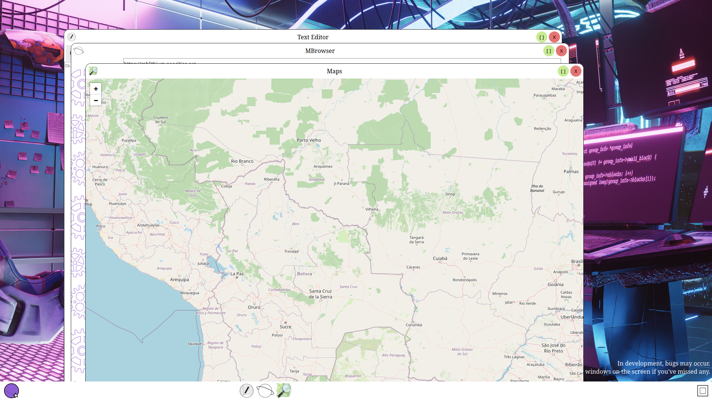

# SpaceWebDE

This is an experiment in a "Web Desktop Environment", which provides a place that simulates a desktop for each logged in user. For now, only the frontend core is under development, but I intend to implement login and save customizations in the linked account in the future.

## Why?

Well, it's a great learning experience and a project for me to train on, it still has a clear objective and possibility of use.

## How to test

To test, just enter the github pages link on the side. Or click this link.